# 포트폴리오

---

## 👤 소개

| 항목       | 내용                             |
| ---------- | -------------------------------- |
| **이름**   | 양지웅                           |
| **이메일** | didwldnd0722@gmail.com           |
| **GitHub** | https://github.com/Peppertunacan |

---

## 📝 자기소개

데이터 파이프라인부터 IoT 임베디드, 프론트엔드까지 **End-to-End 개발 경험**을 보유한 개발자입니다.

Airflow/Kafka/Spark 기반 ETL 파이프라인 구축, Raspberry Pi와 RFID를 활용한 IoT 시스템 개발, Next.js/React Native 기반 사용자 인터페이스 구현까지 — 데이터가 수집되어 사용자에게 전달되기까지의 **전체 흐름을 이해하고 구현**할 수 있습니다.

새로운 기술 스택에 빠르게 적응하며, 각 레이어 간의 연결과 최적화에 관심을 가지고 있습니다.

---

## 🛠 기술 스택

### Frontend


### Mobile


### Backend


### IoT / Embedded


### Data Engineering


### Database


### DevOps & Infra


---

## 📂 프로젝트

### 1. Agora - 실시간 뉴스 토픽 분석 플랫폼

> 정치·사회 이슈에 대한 찬성/반대/중립 입장을 시각화하여 보여주는 한국형 공론장 플랫폼

|                      메인 페이지                       |                        토픽 상세 페이지                        |
| :----------------------------------------------------: | :------------------------------------------------------------: |
| 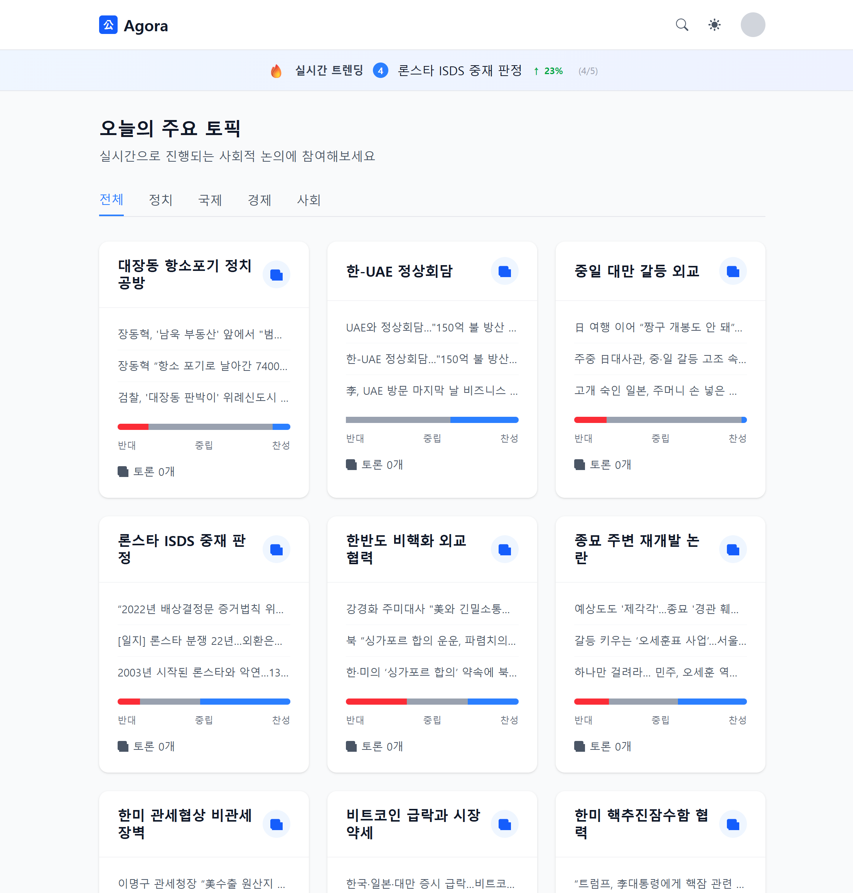 | 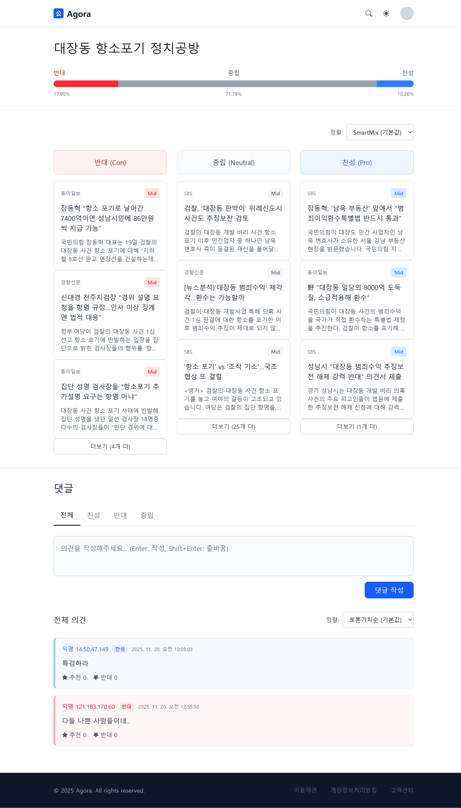 |

| 항목       | 내용                                   |
| ---------- | -------------------------------------- |
| **기간**   | 2025.10.27 ~ 2025.11.20                |
| **인원**   | 4                                      |
| **역할**   | Frontend Developer                     |
| **GitHub** | https://github.com/Peppertunacan/agora |

#### 🎯 주요 기능 (프로젝트 전체)
- **🤖 AI 자동 분류**: OpenAI GPT를 활용한 뉴스 토픽 분류 및 입장(찬/반/중립) 감성 분석
- **📊 입장별 시각화**: 찬성 / 반대 / 중립 3단 레이아웃으로 기사 비교
- **🔥 실시간 트렌딩**: 가장 활발하게 논의되는 토픽 실시간 추적
- **💬 토론 플랫폼**: 토픽별 의견 작성 및 입장 표명
- **📰 뉴스 자동 수집**: RSS 피드 기반 실시간 뉴스 크롤링

#### 🛠 기술 스택
- **Framework**: Next.js 16.0.1 (App Router) + React 19.2.0
- **Language**: TypeScript 5
- **Styling**: Tailwind CSS 4
- **Theme**: next-themes 0.4.6
- **Notification**: react-hot-toast 2.6.0
- **Lint/Format**: ESLint 9 + Prettier 3.6.2

#### 💡 담당 업무 및 구현 내용

**1. 렌더링 전략 설계 및 구현**
- **SSR**: 토픽 상세, 기사 상세 페이지 - SEO 및 초기 로딩 최적화
- **ISR**: 메인 페이지(60초), 토픽 페이지(300초) - 정적 생성 + 주기적 갱신
- **CSR**: 댓글 시스템, 카테고리 필터, 테마 토글 - 인터랙티브 기능

**2. API 서비스 레이어 아키텍처**
- Custom Fetch Client 구현 (타임아웃, 로깅, 캐싱, 에러 핸들링)
- Service Layer Pattern으로 관심사 분리
- 백엔드 ↔ 프론트엔드 타입 변환 레이어 (`ApiTopic` → `Topic`)

**3. 공통 컴포넌트 시스템**
- `ThemeToggle`: Hydration mismatch 해결한 다크모드 토글
- `TrendingBanner`: Dynamic Import로 지연 로딩
- `LoadingSkeleton`: 스켈레톤 UI로 CLS(Cumulative Layout Shift) 방지
- `ErrorBoundary`: 선언적 에러 처리

**4. 입장별 스타일 시스템**
- 찬성(PRO): Blue 계열 (`blue-500/600`)
- 중립(NEUTRAL): Gray 계열 (`gray-500/600`)
- 반대(CON): Red 계열 (`red-500/600`)
- `stanceStyles.ts` 유틸리티로 일관된 스타일 적용

#### ⚡ 최적화 및 성과

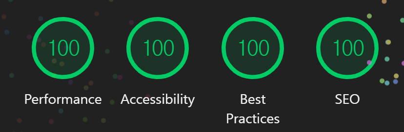

- **Lighthouse 성능 점수 개선**
  - 코드 스플리팅: Dynamic Import로 TrendingBanner 번들 분리
  - ISR 캐싱: 정적 페이지 캐싱으로 TTFB 단축
  - Router Cache: dynamic 30s, static 180s 설정
- **Hydration Mismatch 해결**: 다크모드 토글에서 `mounted` 상태 체크로 SSR/CSR 불일치 해결
- **Next.js 16 마이그레이션**: `params`가 Promise로 변경된 Breaking Change 대응

---

### 2. MSKT (만사경통) - 건설현장 근로자 관리 플랫폼

> 건설 현장, 인력사무소, 원청을 위한 통합 근로자 관리 플랫폼의 Android 모바일 애플리케이션

|                       메인 화면                       |                          계약서                           |
| :---------------------------------------------------: | :-------------------------------------------------------: |
| 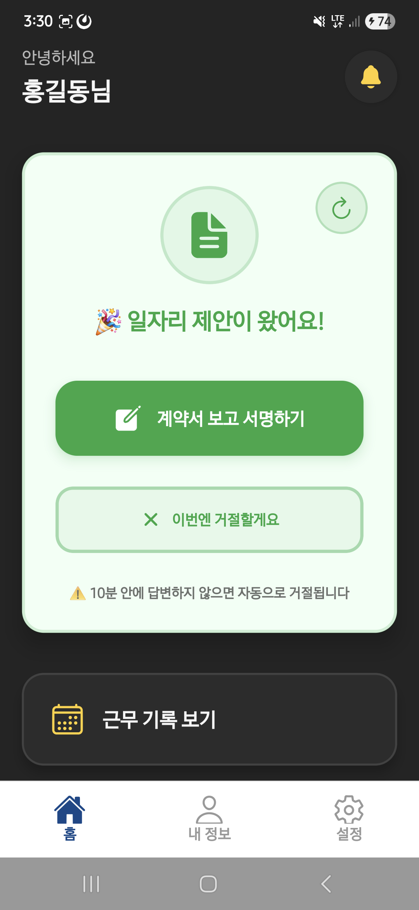 | 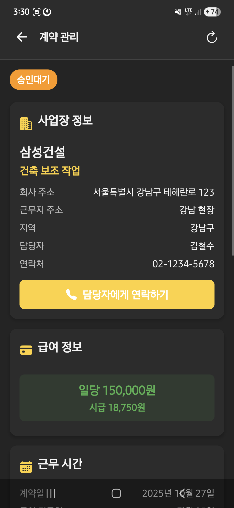 |

|                         전자 서명                          |                         근무 기록                         |
| :--------------------------------------------------------: | :-------------------------------------------------------: |
| 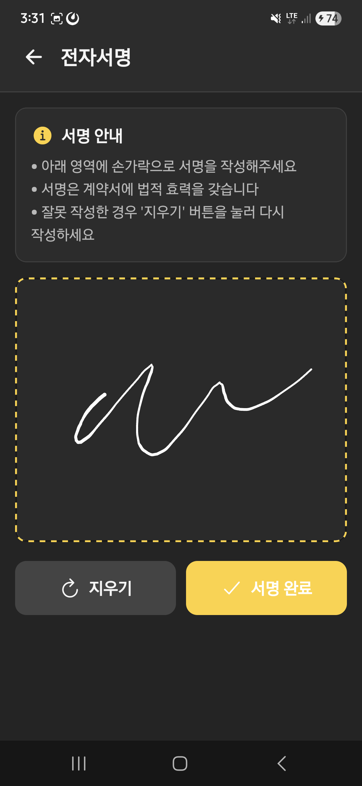 | 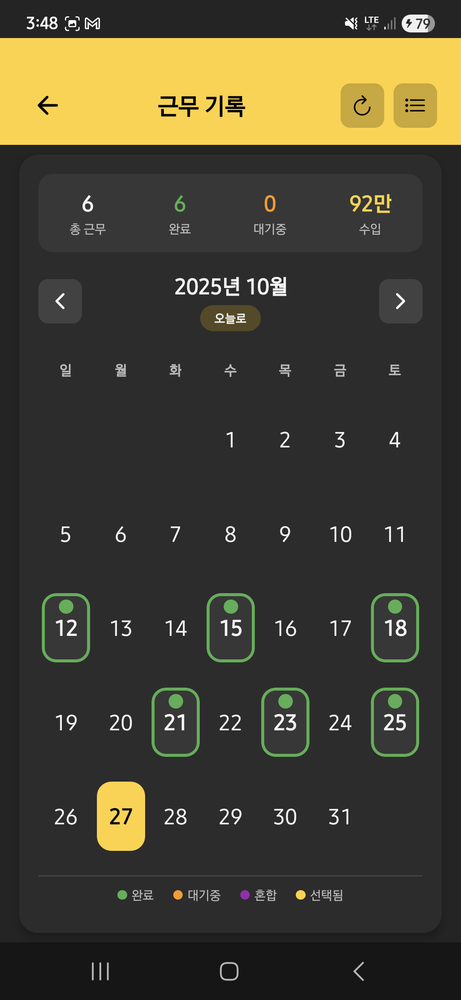 |

| 항목       | 내용                                  |
| ---------- | ------------------------------------- |
| **기간**   | 2025.09.01 ~ 2025.09.29               |
| **인원**   | 5                                     |
| **역할**   | Mobile Developer                      |
| **GitHub** | https://github.com/Peppertunacan/mskt |

#### 🎯 주요 기능 (프로젝트 전체)
- **⏰ 실시간 출퇴근 관리**: QR 스캔 기반 출퇴근 + SSE 실시간 동기화
- **📝 전자 계약서**: 법정 양식 지원, 모바일 전자 서명
- **⛓️ 블록체인 무결성**: Polygon 네트워크 기반 계약 데이터 앵커링
- **🔐 다중 인증**: JWT + 생체인증 + 카카오 OAuth
- **🔔 FCM 푸시 알림**: 계약/출퇴근 상태 변경 알림
- **📄 PDF 생성**: 계약서 PDF 생성 및 AWS S3 저장

#### 🛠 기술 스택
- **Framework**: React Native 0.81.4 + Expo SDK 54
- **Language**: TypeScript 5.9
- **Navigation**: Expo Router 6.0 (파일 기반 라우팅)
- **Animation**: React Native Reanimated 4.1 (Spring 애니메이션)
- **Native APIs**: expo-camera, expo-local-authentication, expo-notifications, expo-secure-store
- **Push**: FCM (google-services.json)
- **State**: React Context API + AsyncStorage

#### 💡 담당 업무 및 구현 내용

**1. 실시간 근무 상태 관리 시스템**
- `WorkStatusContext`: 전역 근무 상태 관리 (IDLE → CONTRACT_PENDING → WORKING → COMPLETED)
- 상태별 `StatusCard` UI 동적 렌더링 (Spring 애니메이션)
- 앱 포그라운드 복귀 시 자동 상태 동기화

**2. QR 코드 출퇴근 시스템**
- `expo-camera`를 활용한 QR 코드 스캔
- QR 데이터 파싱 (JSON / 숫자 형식 지원)
- 체크인 API 연동 및 에러 핸들링

**3. 전자 서명 시스템**
- `react-native-signature-canvas`로 서명 입력
- 서명 데이터 Base64 인코딩 → API 전송
- 서명 확정 전 확인 다이얼로그

**4. FCM 푸시 알림 (`NotificationService`)**
- Expo Push Token 발급 및 서버 등록
- Android 알림 채널 설정 (`setNotificationChannelAsync`)
- 포그라운드/백그라운드 알림 핸들링
- `SecureStore`를 활용한 토큰 관리
- 중복 등록 방지 플래그 (`isRegisteringToken`)

**5. 생체인증 서비스 (`BiometricService`)**
- Android 지문인식 통합
- 하드웨어 지원 여부 및 등록 상태 확인
- 인증 실패 시 디바이스 비밀번호 폴백

**6. 모듈화된 컴포넌트 시스템**
- `Contract/`: 계약서 UI 컴포넌트 (Header, Period, Terms, SalaryInfo 등 10개 모듈)
- `StatusCard/`: 상태별 카드 컴포넌트
- `WorkHistory/`: 근무 기록 컴포넌트

**7. 프로젝트 관리 (PM)**
- Jira 에픽/스토리/태스크 3단계 백로그 관리, 스프린트 번다운 차트로 병목 식별 및 일정 조율, 스토리 포인트 기반 작업량 산정
- Jira + Git + Mattermost 연동 자동화 (커밋/PR → 티켓 상태 업데이트 → 메신저 알림)
- Notion으로 기능 명세서, API 문서, 회의록 통합 관리
- 일일 스탠드업 미팅 진행, 도메인별 진척사항 트래킹
- 기획 및 요구사항 정의 주도
- 중간/최종 발표 진행

#### ⚡ 최적화 및 성과
- **앱 번들 크기**: ~15MB (압축 후)
- **Android 최적화**: Material Design, Edge-to-Edge 디자인, 알림 채널 분리
- **메모리 누수 방지**: useEffect cleanup으로 리스너 정리
- **동시성 제어**: 토큰 등록/삭제 시 플래그 기반 중복 호출 방지

---

### 3. SOBI - AIoT 스마트 바스켓

> RFID 기술과 AI를 결합한 차세대 스마트 쇼핑 솔루션의 IoT/Embedded 시스템 개발

| 항목       | 내용                                                           |
| ---------- | -------------------------------------------------------------- |
| **기간**   | 2025.07.15 ~ 2025.08.17                                        |
| **인원**   | 6                                                              |
| **역할**   | **Project Manager** / IoT·Embedded Developer                   |
| **GitHub** | https://github.com/Peppertunacan/smart-online-basket-interface |

#### 📸 스크린샷

<table>
  <tr>
    <td>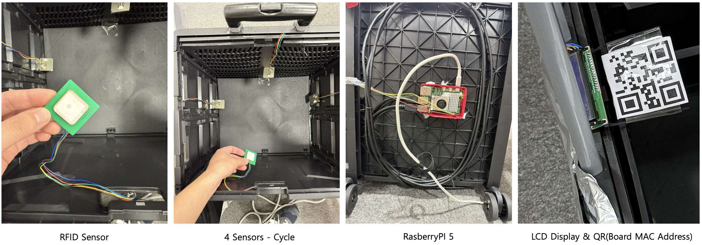</td>
    <td>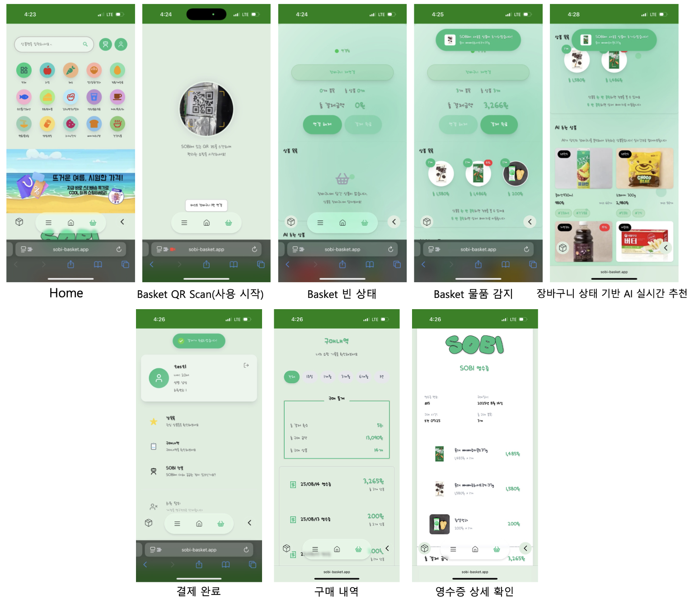</td>
  </tr>
  <tr>
    <td align="center"><b>하드웨어 구성</b></td>
    <td align="center"><b>프론트엔드 UI</b></td>
  </tr>
</table>

#### 🎯 주요 기능 (프로젝트 전체)
- 📡 **실시간 RFID 상품 인식**: YRM1001 리더기로 장바구니 내 상품 자동 감지
- 🔄 **실시간 장바구니 UX**: SSE 기반 상품 추가/제거 즉시 반영
- 🤖 **AI 개인화 추천**: TF-IDF + SessionKNN, Two-Tower 모델 기반 맞춤 추천
- 📱 **PWA 지원**: 네이티브 앱 수준의 모바일 사용자 경험
- 💳 **QR 셀프 체크아웃**: 무인 결제 시스템 연동

#### 🛠 기술 스택
- **Language**: Python 3.9+
- **Hardware**: Raspberry Pi, YRM1001 RFID Reader, I2C LCD (16x2)
- **Protocol**: MQTT (Paho MQTT 1.6+)
- **Library**: RPi.GPIO, RPLCD, pyserial

<p align="center">
  
  <br><b>시스템 아키텍처</b>
</p>

#### 💡 담당 업무 및 구현 내용

**1. MQTT 메인 컨트롤러** (`mqtt_controller.py`)
- 백엔드 명령 구독 (`start`/`end`/`total`)
- RFID 시스템 생명주기 관리 (시작/종료)
- `CartManager`, `MultiSensorManager` 통합 제어
- JSON 메시지 프로토콜 처리

**2. RFID 센서 모듈** (`rfid_minimal/`)
```
embedded/rfid_minimal/
├── core/
│   ├── models.py      # 태그 데이터 모델
│   └── parser.py      # EPC 코드 파서
├── sensors/
│   ├── connection.py  # 시리얼 연결 핸들러
│   └── rfid_reader.py # 멀티폴링 RFID 리더
├── managers/
│   ├── cart_manager.py   # 장바구니 상태 관리
│   └── sensor_manager.py # 다중 센서 관리
├── protocols/         # 통신 프로토콜
└── utils/             # 유틸리티
```

- **CartManager**: 폴링 사이클 기반 상품 상태 추적
  - 상품 감지/제거 임계값 알고리즘
  - 연속 감지 횟수 기반 안정적인 상태 판정
- **RFIDReader**: 멀티폴링 방식 태그 스캔
  - 시리얼 통신 관리 (pyserial)
  - RSSI 기반 태그 감지 정확도 향상
  - 태그 콜백 이벤트 처리

**3. LCD 디스플레이 제어** (`lcd_indicator.py`)
- I2C 16x2 LCD 패널 초기화 및 제어
- 실시간 총 금액 표시 (천단위 포맷팅)
- 백라이트 자동 on/off 관리

**4. MQTT 통신 모듈** (`mqtt/`)
- Paho MQTT 기반 Pub/Sub 구현
- 토픽 구조: `basket/{id}/status`, `basket/{id}/update`
- JSON 페이로드 직렬화/역직렬화
- QoS Level 1 적용으로 메시지 전달 보장
- 브로커 재연결 로직 및 연결 유실 복구

**5. 프로젝트 관리 (PM)**
- Jira 에픽/스토리/태스크 3단계 백로그 관리, 스프린트 번다운 차트로 병목 식별 및 일정 조율, 스토리 포인트 기반 작업량 산정
- Jira + Git + Mattermost 연동 (티켓 → 커밋/PR → 메신저 알림 자동화)
- Notion으로 기능 명세서, API 문서, 회의록, 통신 프로토콜 등 통합 관리
- 일일 스탠드업으로 HW/SW 팀 간 진척사항 공유 및 이슈 조율
- 기획 및 요구사항 정의 주도
- 중간/최종 발표 진행

#### ⚡ 최적화 및 성과
- **실시간 응답 속도**: 상품 인식 후 프론트엔드/LCD 업데이트 **2초 이내** 달성
- **MQTT 메시지 신뢰성**: QoS Level 1 적용으로 데이터 유실 방지
- **RSSI 기반 태그 감지**: 신호 강도 기반 필터링으로 오인식률 감소
- **폴링 사이클 상태 관리**: 연속 감지 횟수 기반 안정적인 상품 추적
- **Raspberry Pi 리소스 최적화**: 효율적인 메모리/CPU 사용
- **백라이트 자동 관리**: LCD 미사용 시 자동 off로 전력 절약

---

### 4. AI News Curation - AI 뉴스 큐레이션 서비스

> AI 기반 뉴스 큐레이션 서비스 - 수집부터 추천까지 전체 파이프라인 구현

| 항목       | 내용                                                                                                                                    |
| ---------- | --------------------------------------------------------------------------------------------------------------------------------------- |
| **기간**   | 2025.04.11 ~ 2025.05.27                                                                                                                 |
| **인원**   | 2                                                                                                                                       |
| **역할**   | **Full Stack Developer** (Backend, Frontend, Data Engineering)                                                                          |
| **GitHub** | https://github.com/Peppertunacan/front-pjt<br>https://github.com/Peppertunacan/backend-pjt<br>https://github.com/Peppertunacan/data-pjt |

#### 📸 스크린샷

<table>
  <tr>
    <td>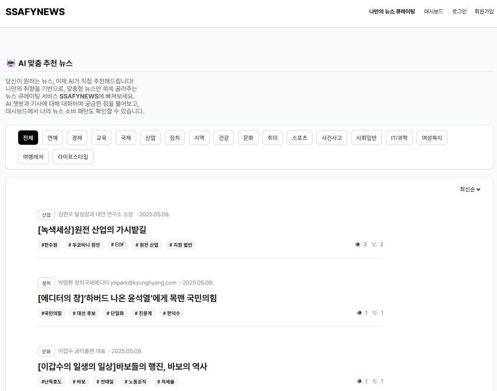</td>
    <td>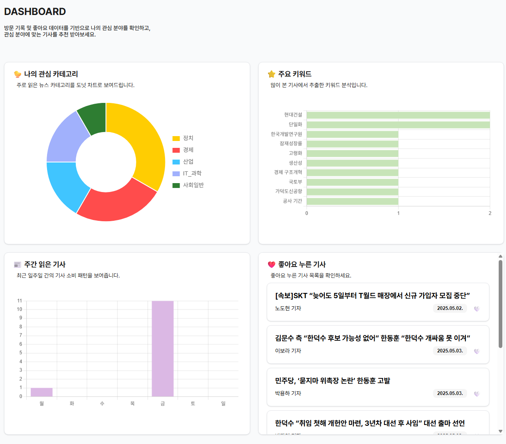</td>
  </tr>
  <tr>
    <td align="center"><b>AI 맞춤 추천 메인</b></td>
    <td align="center"><b>통계 대시보드</b></td>
  </tr>
  <tr>
    <td>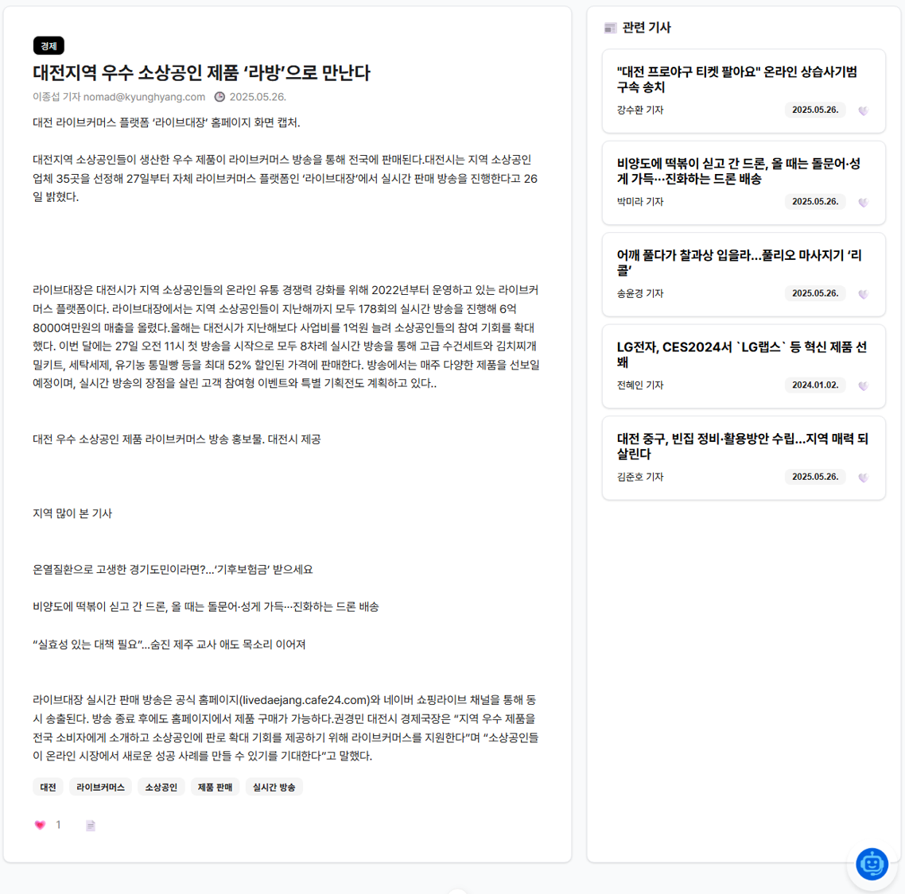</td>
    <td>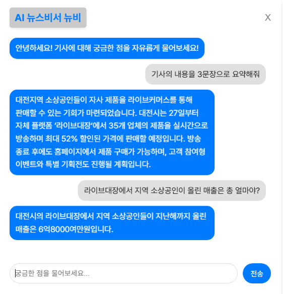</td>
  </tr>
  <tr>
    <td align="center"><b>기사 상세 페이지</b></td>
    <td align="center"><b>AI 뉴스비서 챗봇</b></td>
  </tr>
</table>

#### 🎯 주요 기능 (프로젝트 전체)
- 📰 **뉴스 자동 수집**: RSS 피드 기반 실시간 뉴스 수집 파이프라인
- 🤖 **AI 자동 분류**: GPT-4o-mini로 카테고리/키워드 자동 추출
- 🔍 **전문 검색**: Elasticsearch 기반 검색 및 자동완성
- 💬 **AI 챗봇**: LangChain RAG 기반 기사 질의응답
- 📊 **통계 대시보드**: 카테고리/키워드/요일별 시각화
- ❤️ **맞춤 추천**: 사용자 관심사 기반 기사 추천

#### 🛠 기술 스택

**Backend**
- Django 5.1.2 + Django REST Framework
- PostgreSQL + pgvector (벡터 임베딩)
- Elasticsearch 8.x (전문 검색)
- LangChain + OpenAI API (챗봇)
- JWT 인증 (simplejwt)

**Frontend**
- Vue 3 (Composition API) + Vite 5
- Pinia (상태관리)
- Vue Router 4
- Chart.js + vue-chartjs (시각화)
- SCSS

**Data ETL**
- Apache Airflow (워크플로우 오케스트레이션)
- Apache Kafka (메시지 스트리밍)
- Apache Flink (실시간 처리)
- Apache Spark (배치 처리)
- HDFS (분산 저장)

<p align="center">
  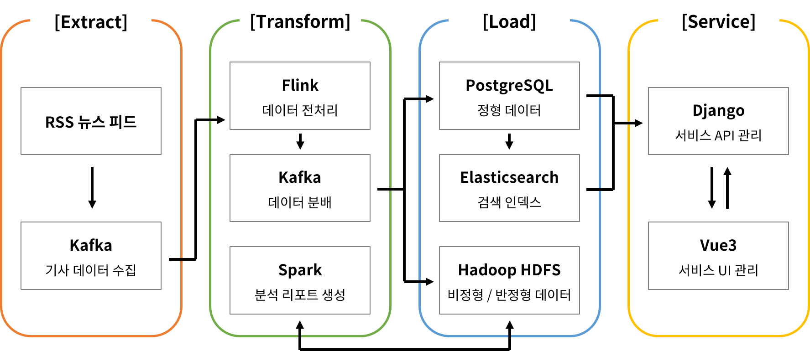
  <br><b>ETL 데이터 파이프라인 아키텍처</b>
</p>

#### 💡 담당 업무 및 구현 내용

**1. Backend - Django REST API**
```
backend-pjt/
├── accounts/           # 사용자 인증
│   ├── models.py      # User 모델
│   ├── views.py       # 회원가입/로그인
│   └── serializers.py
├── mynews/             # 뉴스 기사
│   ├── models.py      # Article, UserArticleInteraction
│   ├── views.py       # 목록, 상세, 좋아요, 챗봇
│   └── serializers.py
└── myproject/          # 프로젝트 설정
```

- JWT 기반 인증 시스템
- RESTful API 설계 및 구현
- Elasticsearch 연동 검색 API
- pgvector를 활용한 벡터 유사도 검색
- LangChain 기반 RAG 챗봇

**2. Frontend - Vue.js SPA**
```
front-pjt/src/
├── views/              # 페이지 컴포넌트
│   ├── NewsView.vue
│   ├── NewsDetailView.vue
│   ├── DashBoardView.vue
│   ├── RecommendView.vue
│   └── SearchView.vue
├── components/         # 재사용 컴포넌트
│   ├── NewsCard.vue
│   ├── Chatbot.vue
│   └── ArticlePreview.vue
├── stores/             # Pinia 스토어
└── composables/        # Vue Composables
```

- Composition API 기반 컴포넌트 설계
- Pinia를 활용한 전역 상태 관리
- Chart.js 기반 대시보드 시각화
- 반응형 UI 및 SCSS 스타일링

**3. Data ETL Pipeline**
```
data-pjt/airflow/dags/
├── news_collector.py      # 뉴스 수집 DAG
├── daily_report_dag.py    # 일일 리포트 DAG
└── scripts/
    └── news_collector/
        ├── producer_main.py       # Kafka Producer
        ├── flink_transform_job.py # Flink 실시간 처리
        ├── spark_process_news.py  # Spark 배치 처리
        └── rss/                   # RSS 수집기
```

- Airflow DAG 설계 및 스케줄링
- Kafka Producer/Consumer 구현
- Flink 실시간 스트림 처리
- Spark 배치 처리 및 분석
- GPT-4o-mini API를 활용한 자동 분류
- text-embedding-3-small을 활용한 벡터화

#### ⚡ 최적화 및 성과
- **실시간 + 배치 처리**: Flink 실시간 처리와 Spark 배치 처리 하이브리드 아키텍처
- **벡터 검색**: pgvector + text-embedding-3-small로 의미 기반 유사 기사 검색
- **Elasticsearch 검색 성능**: 한국어 형태소 분석기(Nori) 적용, 자동완성 최적화
- **RAG 챗봇**: LangChain + 벡터 DB로 기사 기반 정확한 답변 생성
- **DAG 스케줄링**: Airflow로 수집/분류/임베딩 파이프라인 자동화

---

## 🎓 학력 및 교육사항

| 기간              | 학교                  | 전공                      | 비고      |
| ----------------- | --------------------- | ------------------------- | --------- |
| 2019.06 ~ 2025.02 | 경북대학교            | 컴퓨터학부 심화컴퓨터학과 | 졸업      |
| 2025.01 ~ 2025.12 | 삼성청년AI·SW아카데미 | 데이터트랙                | 수료 예정 |
---

## 📜 자격증 및 수료

| 취득일     | 자격증/수료증       | 발급기관             |
| ---------- | ------------------- | -------------------- |
| 2024.06.18 | 정보처리기사        | 한국산업인력공단     |
| 2025.03.21 | 데이터분석 준전문가 | 한국데이터산업진흥원 |
| 2025.07.11 | 빅데이터분석기사    | 한국데이터산업진흥원 |

---

## 📞 Contact

- 📧 Email: didwldnd0722@gmail.com
- 🐙 GitHub: https://github.com/Peppertunacan

---

<div align="center">

*Thank you for reading my portfolio!*

</div>
